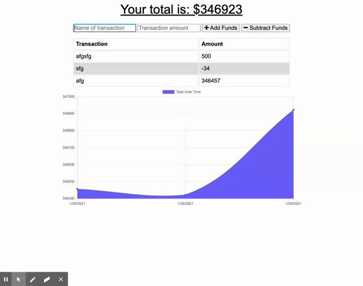

# Budget Tracker App

## Description 
This is a PWA designed to track your income and expenses, it is capable of storing entries while offline, and will push to db when back online so that all of your purchases are tracked!

## Table of Contents
1. [Installation](##Installation)
2. [Usage](##Usage)
3. [Contributors](##Contributors)
4. [License](##License)
5. [Contact](##Contact)
6. [Live Deployment](#Live-Deployment)
7. [Gif of App](#Gif-of-App)

## Installation
Use live deployment https://budget-tracker-jt.herokuapp.com/
## Usage 
Made for personal use.
## License  MIT
Please see License in repo
## Contributors
Jasmine Teters
## Tests
Use live deployment https://budget-tracker-jt.herokuapp.com/
## Contact
To view the code for this project visit the github profile below.
Github Profile: [jasmineteters](github.com/jasmineteters)

For any questions contact us via email.
Email: [jasmineteters2020@gmail.com](mailto:jasmineteters2020@gmail.com)

## Live Deployment:

Link to the GitHub Repo: https://github.com/jasmineteters/Budget-Tracker
Link to the GitHub live page: https://budget-tracker-jt.herokuapp.com/

## Gif of App:

